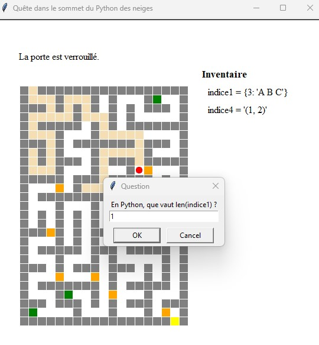

# Castle Game

The MOOC project "Apprendre à coder" on [FunMOOC](https://www.fun-mooc.fr/) aims to create a game of escape 
that puts into practice everything covered in the course.  
The game will challenge players to use their coding skills 
to solve puzzles and escape the game.  
This project provides a hands-on way for learners to apply their knowledge 
and skills from the course.  
A MOOC is a Massive Open Online Course, 
which is a type of online learning platform that allows large numbers of participants 
to take courses on a wide range of subjects.

## Description

This project involves programming an **escape game /maze**
where the player uses keyboard commands to control a character in a castle represented in a 2D map. 
The castle consists of empty spaces (rooms, corridors), walls, doors
that the character can only pass through by answering questions,
collectible objects that help the character find the answers to these questions,
and the exit/quest of the castle. 
The goal of the game is to reach the quest.  
The program will use the **turtle module** as a graphical interface and consist of two main parts:
the **drawing of the castle map** and the **management of the game** on the drawn map
(handling the character's movements within the castle, displaying collected objects, and managing door openings).  
The necessary data (castle map, objects, doors) is encoded in 3 text files.
A set of data files is provided and the task is to implement a game program that uses this data.  

## Storytelling

Lancelot enters the castle at the top of Snowy Python, armed with his valuable storage bag 
and his freshly lit torch for Beltane fires. 
He must find the statue of Saint Axerror, the masterpiece of Gide de Rome, known as the "eternal evil tyrant".  
Fortunately, to help him in his quest, Merlin, his master, has provided him with a detailed plan 
of the castle's rooms and corridors. 
This plan will be very useful, given the enormity of the building, both in size and number of rooms! 
Before leaving, Merlin gave him the key to the castle's front door and gave him many tips, 
including keeping all the objects he will find on his quest: 
they will allow him to answer the various riddles that the guards posted in front of the doors 
inside the castle will not fail to pose. 
Merlin assured his disciple that if he proceeds intelligently, his quest will be satisfied.

---
<u>Author</u>: **DZ** 

